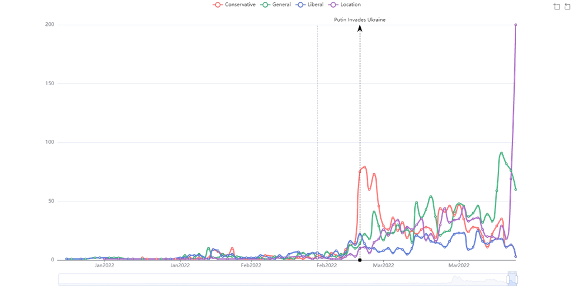
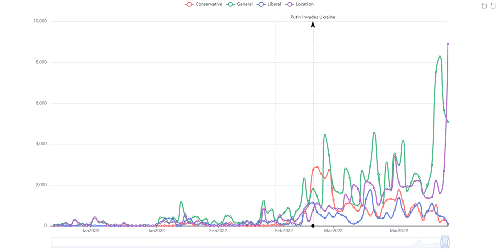
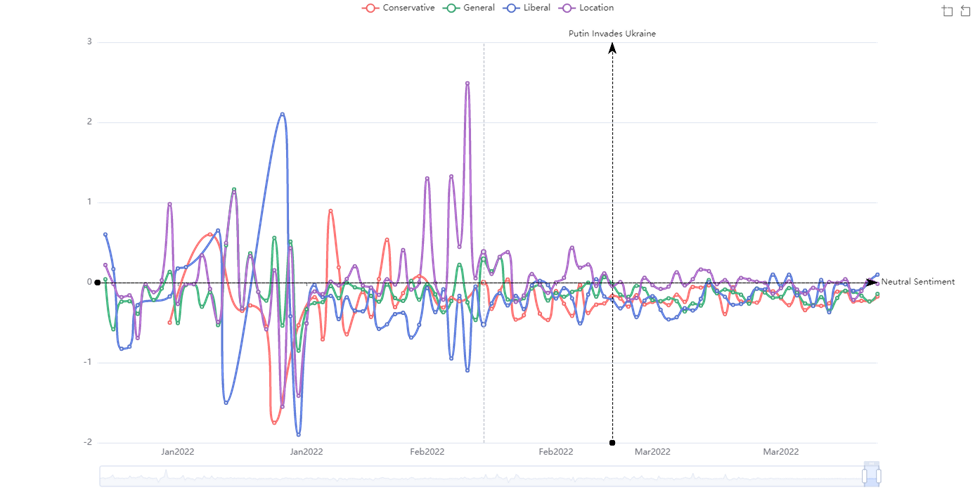
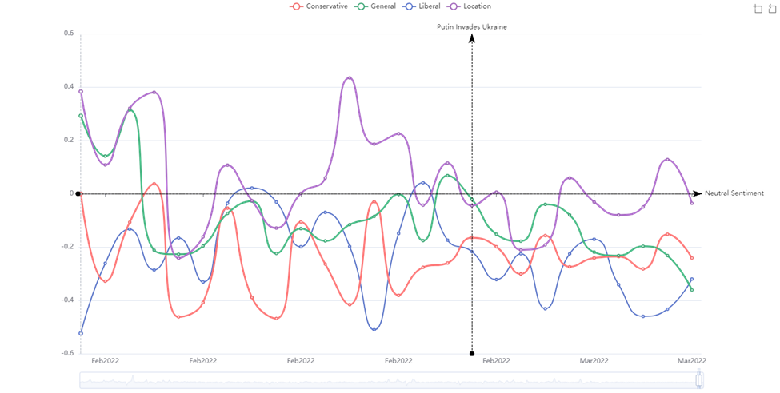
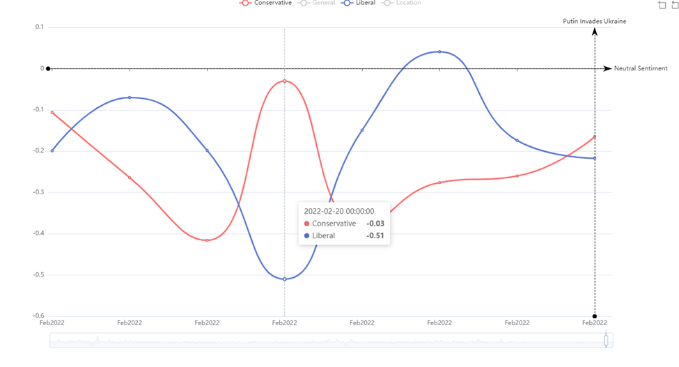
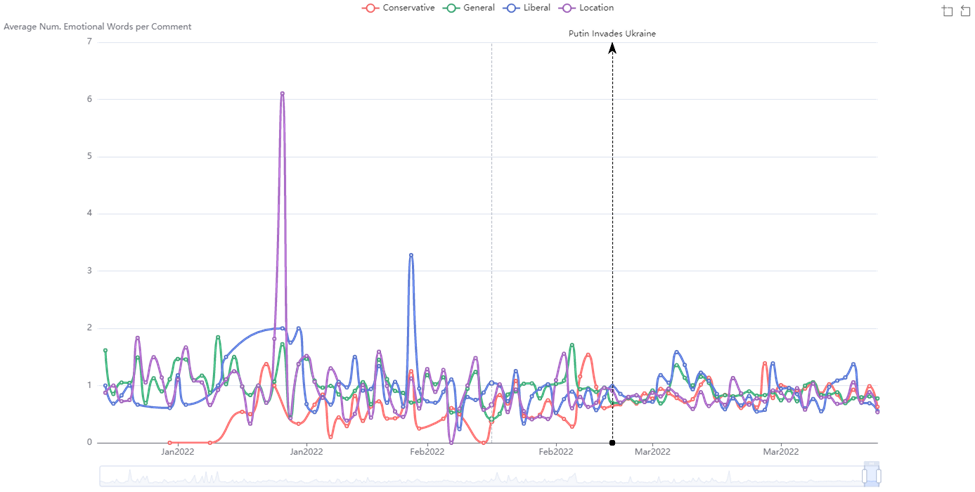
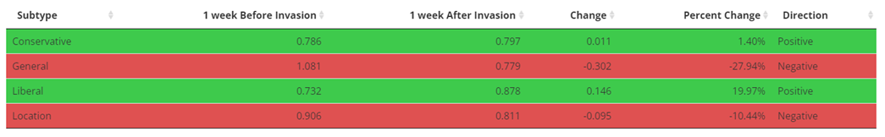
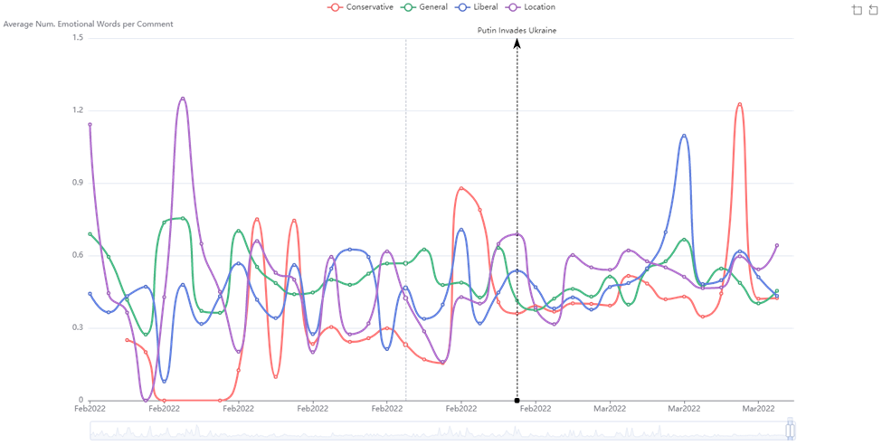
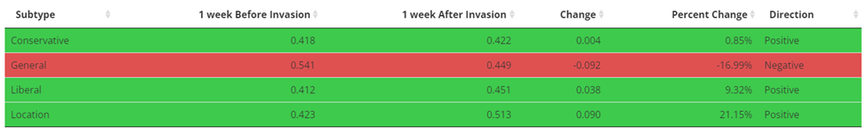

## Table of Contents
1. [Introduction](#introduction)
2. [Process](#process)
    1. [Data Overview](#data-overview)
        1. [Subreddit Types](#subreddit-types)
    2. [Methodology](#methodology)
        1. [Webscraping using the Reddit API](#webscraping-using-the-reddit-api)
        2. [Text Processing](#text-processing)
        3. [Sentiment Analysis](#sentiment-analysis)
3. [Results](#results)
    1. [Sentiment Analysis and Emotions](#sentiment-analysis-and-emotions)
4. [Conclusion](#conclusion)
5. [Rshiny](#rshiny)


## Introduction

Throughout history Russia and Ukraine have had a contentious relationship.. In the past decade, Russia has taken a more aggressive approach starting with annexing a region of Ukraine that connects to the Black Sea called Crimea on March 18, 2014 ([1](https://www.cnn.com/europe/live-news/ukraine-russia-news-02-24-22-intl/index.html)). This action led to a series of altercations culminating in a Russian invasion of Ukraine on February 24th, 2022 ([2](https://www.nytimes.com/2014/03/19/world/europe/ukraine.html)). Outside of Eastern Europe, the rest of the world has also been reacting to the events in the region. Media portrayals have credited the growing polarization in the West as resulting in seemingly differing responses to these actions in the East. It is important, however, to conduct a study that will allow us to see the reality of the situation and understand if, in regards to the events of the East, sentiment/emotions have actually differed amongst the very polarized political ideologies. Using the Russian invasion on February 24th, 2022, as a landmark, a thorough sentiment analysis was conducted to investigate this question. The social media platform used for this particular study was Reddit. Reddit was chosen because of its pseudo-anonymity; pseudo-anonymity in this case means that often Reddit accounts do not contain personally identifiable information to individuals, the pseudo part is for the fact that some users wish to contain personally identifiable information. The pseudo-anonymity present in Reddit typically leads to people being more honest in the thoughts and opinions that they share online, since they are not worried about public backlash for a potentially controversial opinion. Reddit was the perfect platform to use in studying sentiment analysis in regard to the Russia Ukraine conflict amongst the differing conservative and liberal ideologies.

## Process

### Data Overview

The data which was used in this study consisted of 314k comments from 5.7k threads across 35 mostly political subreddits. The 35 political subreddits were separated into four categories: Conservative, Liberal, General, Location. The Conservative and Liberal labels are intuitive, General refers to subreddits that attempt to stay neutral, such as r/PoliticalDiscussion, Location refers to subreddits that are focused on opinions from a specific region such as r/AskEurope or r/AskAnAmerican. Location and General were categories used to act as controls to the study to not only understand how sentiment/emotions varied across the aisle, but also how it compared to the overall sentiment of the conflict.

### Subreddit Types

1. Liberal
    - r/liberal, r/neoliberal, r/socialism, r/AskaLiberal, r/ToiletPaperUSA, r/democrats, r/ShitLiberalsSay, r/thedavidpakmanshow
2. Conservative
    - r/conservative, r/republican, r/AskThe_Donald, r/GoldandBlack, r/libertarian, r/walkaway, r/tuesday, r/benshapiro, r/jordanpeterson, r/LouderwithCrowder
3. General
    -  r/news, r/politics, r/worldnews, r/Military, r/war, r/anime_titties,  r/history, r/geopolitics, r/PoliticalDiscussion
4. Location
    - r/europe, r/AskEurope, r/ukpolitics, r/ukraine, r/geopolitics, r/askarussian, r/china, r/AskAnAmerican, r/poland

### Methodology

All threads containing the phrase “ukraine” were scraped from the 35 different political subreddits. Note, Reddit’s API limits scraping to at most 250 threads per subreddit following a query. This limit caused some of the subreddits to contain comments going back to 2008, while other subreddits only contain comments that go back a few days before the scraping began. The data was then preprocessed by removing the following:“r/…”, mentions, links, punctuation, html tags and additional non UTF-8 specially encoded characters. In addition to removing parts of comments, some comments were removed if they were posted by a bot. After the text was preprocessed the sentiment was calculated using Syuzhet custom dictionary and the NRC Word-Emotion Association Lexicon was used to evaluate the emotions of each individual comment. After sentiment was calculated per comment, the data was aggregated by day and then the mean sentiment of all comments on a particular day was used. The NRC Word-Emotion Association Lexicon counts the number of words associated with a particular emotion, since comments can be any length on Reddit, there is a potential imbalance where the length of a comment can determine how emotional a particular comment is. To offset the potential imbalance of the number of comments driving emotions, the mean number of emotional words per emotion was then divided by the total number of comments made on that particular day per subreddit to normalize the evaluation metrics. After the emotions and sentiment of each subreddit per day were normalized, another mean was taken to find the overall average sentiment and emotionality of the subreddit type. To  display the findings in an easily digestible way, a shiny app was created.

#### Webscraping using the Reddit API

To scrape the thread URLs, I used the R package [RedditExtractoR](https://rdocumentation.org/packages/RedditExtractoR/versions/3.0.9) which uses the Reddit API to acquire the necessary information. I wrote a custom function, that first grabs the 250 most recent thread URLs which contain the word *ukraine*, and filters the URLs to only include threads that contained >1 comments, the function will then loop through the URLs captured in the first part and grab all the comments and place all the comments in a dataframe. The code used to perform this process is included below.

```
grab_subreddit_content <- function(subreddits_list,
                      keyword = "ukraine",
                      sort_by = "new",
                      period = "all") {

#' Grabs all Reddit comments from threads that contain a keyword from a list of subreddits
#' @param subreddits_list list of subreddits to search
#' @param keyword the word to be searched for in a thread
#' @param sort_by the intended sort specification, the possible values are "hot", "new", "top", "rising"
#' @param period the intended period specification, the possible values are "hour", "day", "week", "month", "year", "all"
#' @return reddit_comments returns all of the comments in a list
#' @examples
#' subreddit_list <- c("machinelearning", "datascience")
#' comments <- map(subreddit_list, ~grab_subreddit_content(.x, keyword="tech"))


  if (!(sort_by %in% c("hot", "new", "top", "rising"))) {
    stop('sort_by must be one of "hot", "new", "top", "rising"')
  }

  if (!(period %in% c("hour", "day", "week", "month", "year", "all"))) {
    stop('period must be one of "hour", "day", "week", "month", "year", "all"')
  }

  get_thread_poss <- possibly(get_thread_content, otherwise = NULL)

  start = Sys.time()

  reddit_urls <- map(subreddits_list,
                         ~find_thread_urls(
                           keywords = keyword,
                           sort_by = sort_by,
                           subreddit = .x,
                           period = period
                         ) %>%
                           filter(comments > 1) %>%
                           pull(url)) %>%
    set_names(subreddits_list)

  reddit_comments <- map(reddit_urls,
                             ~get_thread_poss(.x)) %>%
    set_names(subreddits_list) %>%
    discard(~is.null(.x))

  end = Sys.time()

  print(end - start)

  return(reddit_comments)

}

comments <- map(list_sub, ~grab_subreddit_content(.x))


```

```
convert_to_df <- function(subreddit_comment_list, subreddit) {

#' Grabs all Reddit comments from list of comments from grab_subreddit_content and converts to a dataframe
#' @param subreddit_comment_list list of comments from grab_subreddit_content
#' @param subreddit labels each dataframe with the subreddit searched
#' @return final_df returns all of the comments in a dataframe
#' @examples
#' subreddit_list <- c("machinelearning", "datascience")
#' comments <- map(subreddit_list, ~grab_subreddit_content(.x, keyword="tech"))
#' comment_df <- map2_df(comments, list_sub, convert_to_df)


  final_df <- as.data.frame(subreddit_comment_list[[1]]$comments) %>%
    mutate("subreddit" = subreddit)

  return (final_df)

}

comment_df <- map2_df(comments, list_sub, convert_to_df)

```

#### Text Processing

Text processing is one of the most crucial aspects to any projects that use text as data. Fortunately, or unfortunately the processing techniques are often specific to the data source and the intended use of the data for the project. For this project specifically, there were reddit specific processing that needed to be performed. Whenever a Reddit user decides to delete their comment on a post it will show up as "[deleted]", whenever a reddit comment is removed by a moderator, the comment will show up as "[removed]". For this project, those two phrases do not add any context to the sentiment so I felt it was best to remove comments that contained these phrases altogether. In addition, it is common on Reddit to reference other subreddits by using the phrase "r/OtherSubreddit", often the subreddit name does not always correlate to what the subreddit is about, so to avoid any false information being introduced, I decided to remove these phrases as well to just focus on the prose. After removing Reddit specific text markers, I performed some additional text cleaning processes such as replacing all [smart quotes](https://en.wikipedia.org/wiki/Quotation_marks_in_English) “...”, with regular quotation marks such as \"...\", removing punctuation, and removing all links. The code I used to perform all of these operations is included below.

```
df_sentiment <- df_sentiment %>%
  filter(!(comment %in% c("[removed]", "[deleted]"))) %>%
  filter(!(grepl("This \\w.+ was.+automatically", comment, ignore.case = T))) %>%
  mutate(
    comment = str_replace_all(comment, "[Rr]\\/.+?\\W", " "),
    comment = str_replace_all(comment, "[Rr]\\/.+$", " "),
    comment = str_replace_all(comment, "(http\\S+)\\s?", "") ,
    comment = str_replace_all(comment, "(\r)|(\n)", ""),
    comment = str_replace_all(comment, "\\\031", "'"),
    comment = str_replace_all(comment, "\\\034", "'"),
    comment = str_replace_all(comment, "\\\035", "'"),
    comment = str_replace_all(comment, "&gt;", ""),
    comment = str_replace_all(comment, "[[:punct:]]", ""),
    comment = str_replace_all(comment, "\\s+", " "),
    comment = str_trim(comment, side = "both")
  ) %>%
  filter(comment != "")

```

#### Sentiment Analysis

There are several methods to perform sentiment analysis, I used the R package [syuzhet](https://cran.r-project.org/web/packages/syuzhet/) to perform this analysis. Syuzhet contains several different lexicons that can be used for sentiment analysis, I used Syuzhet to calculate overall sentiment, and then I used the NRC lexicon to calculate the prescence of individual emotions. The code to do that is located below.

```
df_sentiment <- df_sentiment %>%
  cbind(sentiment = get_sentiment(.[["comment"]])) %>%
  cbind(get_nrc_sentiment(.[["comment"]]))

```

After sentiment and emotions were calculated per comment, I performed several aggregations to find how sentiment changes over time. For example, I grouped by subreddit and subreddit type and calculated the mean sentiment of all comments for that specific day. Another example I did was grouped the number of comments and threads relating to the word *ukraine* to show how comments and threads mentioning Ukraine increased dramatically around the time that Russia invaded Ukraine. A summary of my results is included below.

## Results

The first thing to look at was the number of threads containing the word “ukraine”. Below is a graph which shows how the number of mentions of the word “Ukraine” increased significantly immediately before and especially after the Russian invasion on February 24th, 2022.


*Figure 1: Number of threads mentioning the word “Ukraine” per subreddit type created by Greg LeVay 13 May 2022*



*Figure 2: Number of comments mentioning the word “Ukraine” per subreddit type created by Greg LeVay 13 May 2022*

The next thing to look at was overall sentiment to understand if there were significant differences. According to the data, there were not significant differences in overall sentiment between conservative and liberal subreddits around the conflict. This can be observed in the graph below.


*Figure 3: Sentiment Analysis Jan 01 created by Greg LeVay 13 May 2022*

This graph includes data starting on January 1st, 2022. The interesting thing to note here is that sentiment in regard to Ukraine varied widely amongst most of the subreddits in early 2022, but during and after the conflict, the sentiment tended to be more neutral. To gain a more granular view, the above graph was sectioned off to be the few weeks prior and few weeks after the Russian invasion.


*Figure 4: Sentiment Analysis Feb 08 created by Greg LeVay 13 May 2022*

There are a few noticeable trends in the above graph. The first trend to notice is that on the date of the invasion, February 24th, 2022, all of the subreddit types had negative sentiment. This is likely due to the fact that many people viewed this invasion in an overall negative light. Another trend to notice is that on specific days the conservative and liberal sentiment tended to be relative opposites, meaning where one side had a relative maximum, the other side had a relative minimum. For instance, the graph below shows an example of this phenomenon occurring on 20 Feb 2022.


*Figure 5: Min/Max points Sentiment Analysis created by Greg LeVay 13 May 2022*

This trend is likely from specific speeches or political events surrounding the conflict occurring and the two sides having differing opinions of the future outcome of said event.

#### Sentiment Analysis and Emotions

Further insight was gained when looking at specific emotions, particularly negative emotions like anger, sadness, and fear. When looking specifically at “anger”, it is interesting to note that the data gathered as a whole shows that threads and comments had a far greater level of anger towards the situation a month or two prior to the invasion, and anger leveled out to a much greater extent in the few weeks immediately before and after the invasion.


*Figure 6: Anger Graph created by Greg LeVay 13 May 2022*

Furthermore, looking particularly at the week before the invasion and the week after, the Conservative and Liberal categories were the only groups that had an overall increase in the amount of anger used in their comments.


*Figure 7: Anger Average Table created by Greg LeVay 13 May 2022*

Similar to “anger”, when looking at “joy” it’s interesting, however, not too shocking, to note that posts were far more joyous, in the months prior to the invasion, however, again, right before and right after the invasion the joy evident is minimal. Nevertheless, in the week leading up to the invasion and the week following the invasion, the positive emotion level was typically higher in the week following. This can be observed in the graph and table below.


*Figure 8: Joy Graph created by 13 May 2022*


*Figure 9: Joy Average Table created by Greg LeVay 13 May 2022*

## Conclusion

The results of this investigation were fascinating in the fact that they were not as intuitive as previously thought. It was assumed that this particular event would cause people to have overall quite negative outlooks and experience high levels of negative emotions. From the sentiment analysis and emotion analysis it appeared that while people had an overall negative outlook in the weeks leading up to the invasion, it appears that there was more positive sentiment and emotions that quickly came in the weeks following the invasion.

## Rshiny

To further understand trends and to explore how public sentiment on Reddit around the Ukraine-Russia conflict changed, I created a Rshiny dashboard to showcase my analysis as well as allow anyone to explore the dashboard to uncover any other noteworthy trends. The dashboard can be accessed using this link [Current Events](https://gdlevay.shinyapps.io/sentimentanalysisukrainerussia/_w_252e1ce6/_w_cf6604a3/)


*Thank you so much for reading this, please feel free to suggest improvements or provide feedback by contacing me using the links included*

